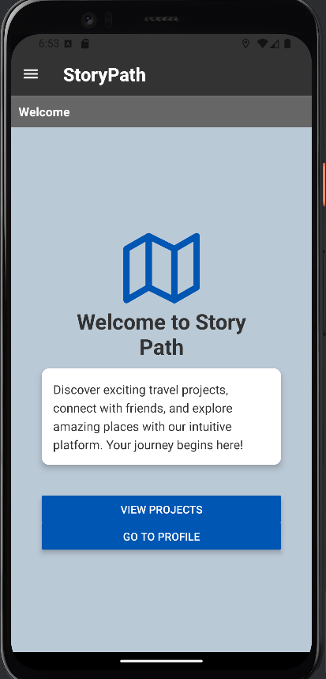
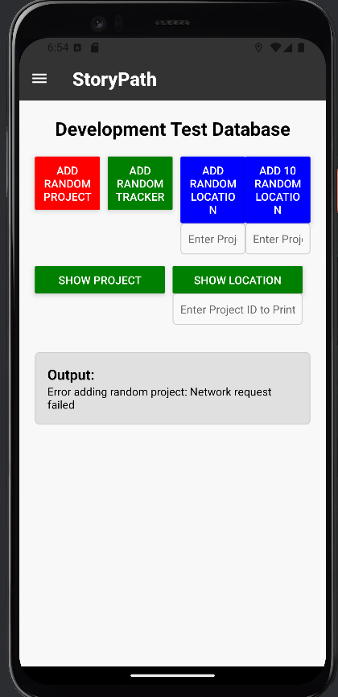

# QR code tracker

*This was done for UQ COMP2410*

---

## About the App

This app supports treasure-hunt and pathfinding challenges by using an external SQL Server to save and load information about locations. 
Using GPS positioning and QR-code scans, it tracks which tags a user has collected.
Currently the SQL Server Is Offline
---

## Screenshots

### Title Page  

### Debug Panel  

The debug panel lets you add or remove user data on the fly.  

